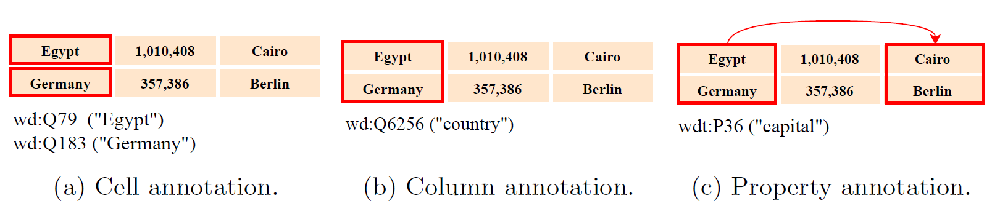
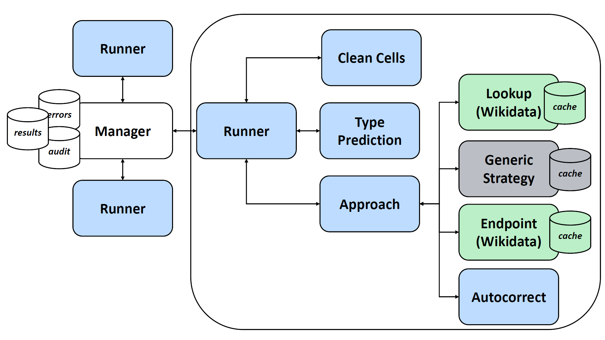

# JenTab
Matching Tabular Data to Knowledge Graphs

* Target Knowledge Graph (KG) is **Wikidata**
* Participant at [SemTab 2021: Semantic Web Challenge on Tabular Data to Knowledge Graph Matching](https://www.cs.ox.ac.uk/isg/challenges/sem-tab/2021/index.html)
* Solves the Semantic Table Annotation (STA) tasks
    * Cell Entity Annotation (CEA)
    * Column Type Annotation (CTA)
    * Column Property Annotation (CPA)



## Architecture 


The image above shows the distributed architecture of JenTab. Here you are a brief description of each service:
* **Manager**: a central node, is responsible for load balancing and collects results, errors and audit records.
* **Runner**: client node which handles the communication among 
    * pre-processing services (Clean Cells, Type Prediction )
    * Approach 
    * Manager 
* **Generic Strategy**: pre-computed service, our primary solution handling miss-spellings. 
* **Solver**: Encapsulates our pipeline in terms of several calls across the dependent services.  
* **Wikidata_Proxy** encapsulates the lookup up and SPARQL query endpoint for DBpedia
* **DBpedia_Proxy** encapsulates the lookup up and SPARQL query endpoint for Wikidata
* **Caching Server** Centralized caching server 


## Quick Setup
The first step of JenTab setup is to structure the [assets](/assets) folder. 
For demonstration, here, we will setup the first round, 

1. Input configuration (dataset)
    * [2020 Dataset per Round](https://zenodo.org/record/4282879#.YIrI57UzZZg)
    * Download tables and targets for Round 1
    * Your downloaded ```tables``` should go under
        * `/assets/data/input/2020/Round 1/`
    * Your downloaded ``CEA_Round1_Targets.csv``, `CTA_Round1_Targets.csv` and `CPA_Round1_Targets.csv` should go under
        * `/assets/data/input/2020/Round 1/targets/`
2. Pre-computed `Generic_Lookup` `db3` files
    * [Generic_Lookup per Round](https://github.com/fusion-jena/JenTab_precomputed_lookup)
    * Download the `db3` file for `R1`
    * Your downloaded `lookup.db3` should go under
        * `/assets/cache/Generic_Lookup/`
3. `Baseline_Approach` requires the stopwords 
    * Download [stopwords.txt](https://gist.github.com/sebleier/554280)
    * Rename the downloaded file to `stopwords.txt`
    * Your file should go under:
        * `/assets/Baseline_Approach/`
* `assets` must have the following directory structure after the previous steps
````      
+--assets
\----data
|   \----cache
|   |   \----Generic_Lookup
|   |           lookup.db3
|   |           
|   \----input
|       \----2020
|           +----Round 1
|           |   +----tables
|           |   \----targets
|                       CEA_Round1_Targets.csv
|                       CTA_Round1_Targets.csv
|                       CPA_Round1_Targets.csv
|
\---Baseline_Approach
|       stopwords.txt
|       
\---Wikidata_Endpoint
        excluded_classes.csv
        excluded_colheaders.csv
````

After the assets are ready, the fastest way to get JenTab up and running is via docker setup, with the following order.

1. ```cd /services```
2. Manager  
    * Change the default credentials in [services/Manager/config.py](/services/Manager/config.py) to yours
        * username: ```YourManagerUsername```
        * password: ```YourManagerPassword```
    * Make sure that the dataset configuration in [services/Manager/config.py](/services/Manager/config.py) is set to:
        * `ROUND = 1` 
        * `YEAR = 2020`
    * Use the following command to lanuch the Manager node 
        * ```docker-compose -f docker-compose.manager.yml up ```
    * Manager is suppose to run at [http://localhost:5100](http://localhost:5100)   
3. All other services ```docker-compose -f docker-compose.yml up```
4. Runner 
    * ```cd /Runner```
    * Change manager credentials in [services/Runner/config.py](/services/Runner/config.py) to your selected ones
    * Make sure that `manager_url = 'http://127.0.0.1:5100' #local` in the [services/Runner/config.py](/services/Runner/config.py)
    * Build an image for the Runner ```docker build runner .```
    * Run ```docker run --network="host" runner```    
        
* Note1: for basic understanding of docker commands, please visit the official documentation of [docker](https://docs.docker.com/get-started/).
* Note2: We also support native execution, but, in this case, you will setup each service on its own. So, we refer to:
    * each folder of each service under [services](/services).
    * [services.md](services/Services.md) summarizes the currently used services and their ports. 


	
## Results

* [Submitted Solution Files](https://github.com/fusion-jena/JenTab_solution_files) 
* [Pre-computed databases for Generic Strategy](https://github.com/fusion-jena/JenTab_precomputed_lookup)

## Materials
* Nora Abdelmageed, Sirko Schindler. **JenTab: A Toolkit for Semantic Table Annotations**. ([Accepted Paper](https://openreview.net/pdf?id=aZUGsoLdpa))
* Nora Abdelmageed, Sirko Schindler. **JenTab: Matching Tabular Data to Knowledge Graphs**. ([paper](http://ceur-ws.org/Vol-2775/paper4.pdf))
* [Ontology Matching workshop](http://om2020.ontologymatching.org/#prg) on 2 November 2020 ([video slides](https://drive.google.com/file/d/1LZzb4x2ay_Vys0qLP4t3rjiwgv368RJ5/view)) 

## Citation 
`@inproceedings{abdelmageed_semtab2021,
  title={{JenTab Meets SemTab 2021's New Challenges}},
  author={Abdelmageed, Nora and Schindler, Sirko},
  booktitle={The 20th International Semantic Web Conference (ISWC)},
  year={2021}
}
`

`
@article{abdelmageed2021jentab,
  title={JenTab: A Toolkit for Semantic Table Annotations},
  author={Abdelmageed, Nora and Schindler, Sirko},
  booktitle={Knowledge Graph Construction (KGC) Workshop ESWC 2021, Accepted}
  year={2021}
}
`

`@inproceedings{abdelmageed2020jentab,
  title={Jentab: Matching tabular data to knowledge graphs},
  author={Abdelmageed, Nora and Schindler, Sirko},
  booktitle={The 19th International Semantic Web Conference (ISWC)},
  year={2020}
}
`
