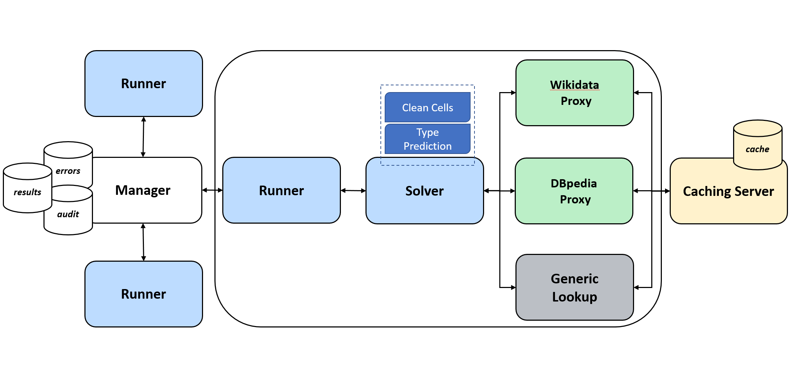

# JenTab
Matching Tabular Data to Knowledge Graphs

* Target Knowledge Graph (KG) is **Wikidata**
* Participant at [SemTab 2020: Semantic Web Challenge on Tabular Data to Knowledge Graph Matching](https://www.cs.ox.ac.uk/isg/challenges/sem-tab/2020/index.html)
* Solves the Semantic Table Annotation (STA) tasks
    * Cell Entity Annotation (CEA)
    * Column Type Annotation (CTA)
    * Column Property Annotation (CPA)


## Architecture 


The image above shows the distributed architecture of JenTab. Here you are a brief description of each service:
* **Manager**: a central node, is responsible for load balancing and collects results, errors and audit records.
* **Runner**: client node which handles the communication among 
    * pre-processing services (Clean Cells, Type Prediction )
    * Approach 
    * Manager 
* **Clean Cells**: aims at cells cleaning in terms of, either generic fix (encoding issues and data clean up) or by more specific cleaning based on the column type.
* **Type Prediction**: Classifies the table column into one of 4 types, those with Wikidata equivalence (QUANTITY, STRING, DATE and OBJECT)
    * OBJECT is our most important type, we look for cells annotation mappings for this type.
* **Lookup** & **Endpoint**: are proxies for the publicly available Wikidata lookup and endpoint. There, we perform our fuzzy search and SPARQL queries.
* **Generic Strategy**: pre-computed service, our primary solution handling miss-spellings. 
* **Approach**: Encapsulates our pipeline in terms of several calls across the dependent services.  

## Quick Setup
The fastest way to get JenTab up and running is via docker setup, with the following order.

1. Manager  ```docker-compose -f docker-compose.manager.yml up ``` 
2. Other services ```docker-compose -f docker-compose.yml up```
3. Runner ```docker run Runner``` assuming the ```Runner``` image is already created

* Note1: for basic understanding of docker commands, please visit the official documentation of [docker](https://docs.docker.com/get-started/).
* Note2: We also support native execution, but, in this case, you will setup each service on its own. So, we refer to:
    * each folder of each service under [services](/services).
    * [services.md](services/Services.md) summarizes the currently used services and their ports. 

## Assets
[assets](/assets) folder conatins all the required materials by services. For example:
* The pre-trained word2vec model for AutoCorrect services.
* How the data should be organized, in terms of tables and targets.
* ... more details in the [ReadMe.md](/assets/README.md)
	
## Results

* [Submitted Solution Files](https://github.com/fusion-jena/JenTab_solution_files) 
* [Pre-computed databases for Generic Strategy](https://github.com/fusion-jena/JenTab_precomputed_lookup)

## Materials
* Nora Abdelmageed, Sirko Schindler. **JenTab: Matching Tabular Data to Knowledge Graphs**. ([paper](http://ceur-ws.org/Vol-2775/paper4.pdf))
* [Ontology Matching workshop](http://om2020.ontologymatching.org/#prg) on 2 November 2020 ([video slides](https://drive.google.com/file/d/1LZzb4x2ay_Vys0qLP4t3rjiwgv368RJ5/view)) 

## Citation 
`@inproceedings{abdelmageed2020jentab,
  title={Jentab: Matching tabular data to knowledge graphs},
  author={Abdelmageed, Nora and Schindler, Sirko},
  booktitle={The 19th International Semantic Web Conference (ISWC)},
  year={2020}
}
`

`
@article{abdelmageed2020jentab,
  title={JenTab: A Toolkit for Semantic Table Annotations},
  author={Abdelmageed, Nora and Schindler, Sirko},
  booktitle={ESWC 2021, Submitted}
  year={2020}
}
`